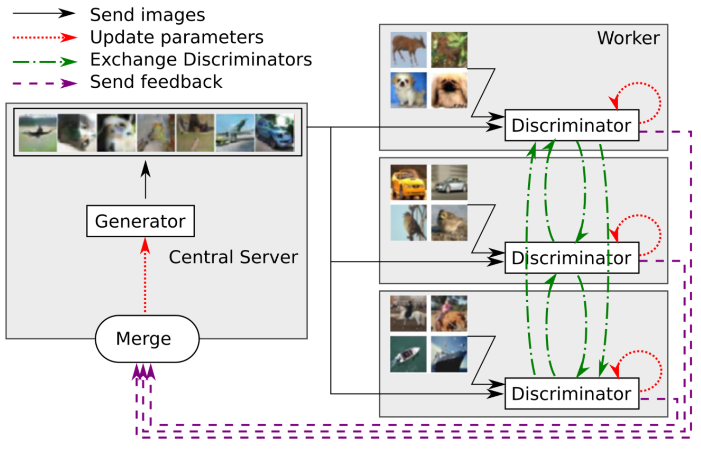
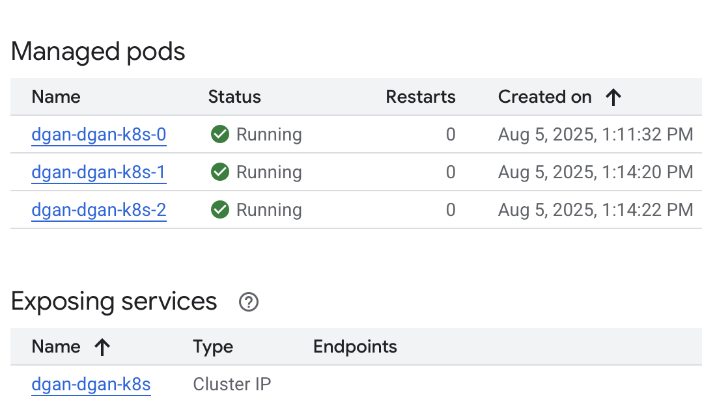
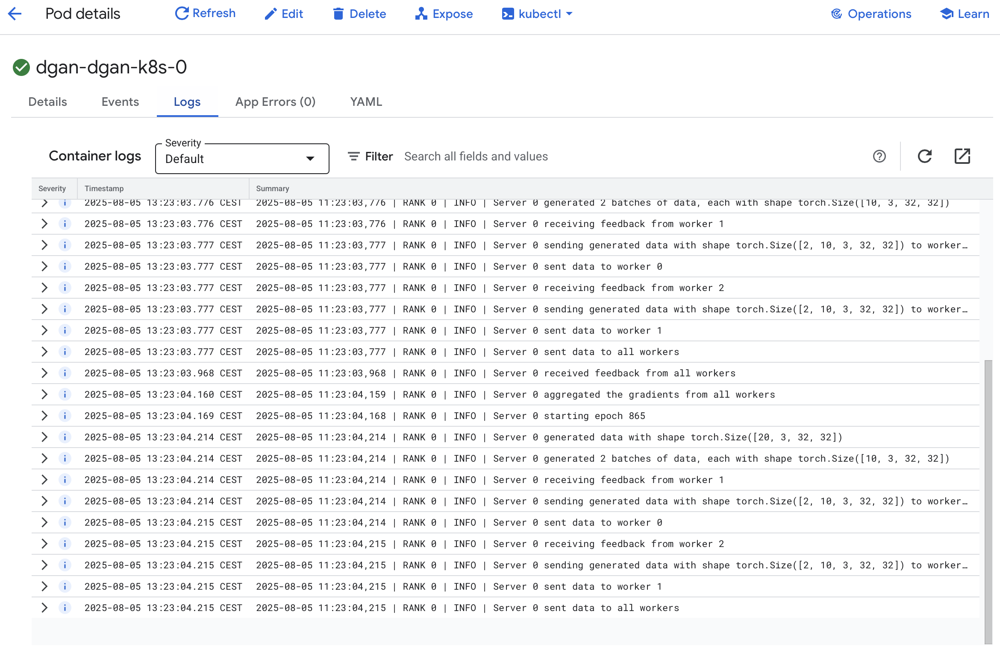
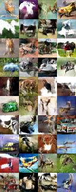

# MD-GAN: Multi-Discriminator Generative Adversarial Networks for Distributed Datasets
This repository provides a **PyTorch implementation of MD-GAN** (Multi-Discriminator Generative Adversarial Networks), designed for **real distributed systems** using Kubernetes, Docker, and Helm.

## Overview
**MD-GAN** enhances traditional GAN training by allowing multiple discriminators, each with access to a different local dataset, to train a shared generator without centralizing the data. This approach improves **scalability**, **performance**, and **data privacy**, especially in distributed or federated learning environments.

## Architecture


- **Generator** is trained at node rank 0
- **Multiple Discriminators** are trained across the worker nodes
- Gradients or loss signals are sent back to the generator
- Data stays **local**, helping preserve privacy

## Kubernetes Architecture
This repo includes a **Kubernetes-native deployment** for MD-GAN using a Helm chart and StatefulSets.
- A **StatefulSet** runs distributed PyTorch workers across pods
- **Rank 0** pod acts as the **central coordinator**, training the global generator
- Remaining pods hold **local discriminators**
- A **headless service** enables DNS-based service discovery and peer communication
- RANK is derived from pod name (e.g., dgan-0, dgan-1, …)
- MASTER_ADDR is always set to dgan-0.dgan for communication
- WORLD_SIZE is automatically injected from Helm values

## Terraform integration
This project includes a Terraform module to automatically provision your GKE Autopilot cluster, configure access, and deploy the MD-GAN Helm chart with no manual steps needed.



## Prerequisites
- Docker
- Kubernetes cluster (e.g., GKE Autopilot)
- Helm
- Python 3.9+

## Fetaures
- ✅ Fully distributed training via PyTorch’s native backend
- ✅ Stateless Helm-based Kubernetes deployment
- ✅ Privacy-preserving: real data never leaves local nodes
- ✅ Compatible with GKE Autopilot
- ✅ Open-source, modular, and production-ready

## Results on CIFAR-10 after 30000 epochs


## Credits
```
@inproceedings{Hardy_2019,
   title={MD-GAN: Multi-Discriminator Generative Adversarial Networks for Distributed Datasets},
   url={http://dx.doi.org/10.1109/IPDPS.2019.00095},
   DOI={10.1109/ipdps.2019.00095},
   booktitle={2019 IEEE International Parallel and Distributed Processing Symposium (IPDPS)},
   publisher={IEEE},
   author={Hardy, Corentin and Le Merrer, Erwan and Sericola, Bruno},
   year={2019},
   month=may }
```
